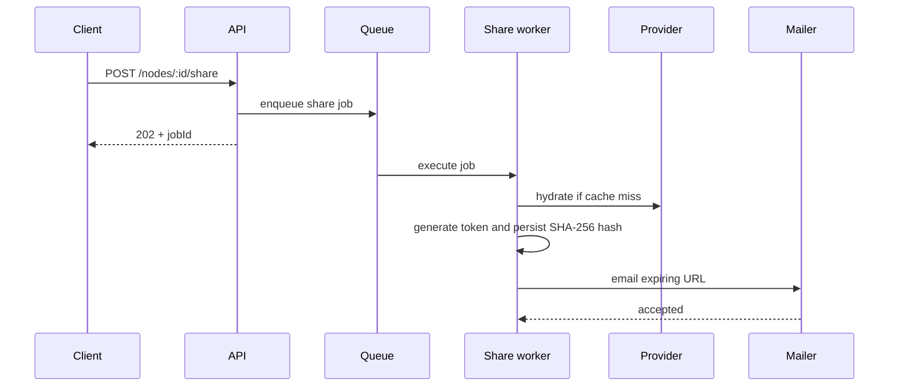
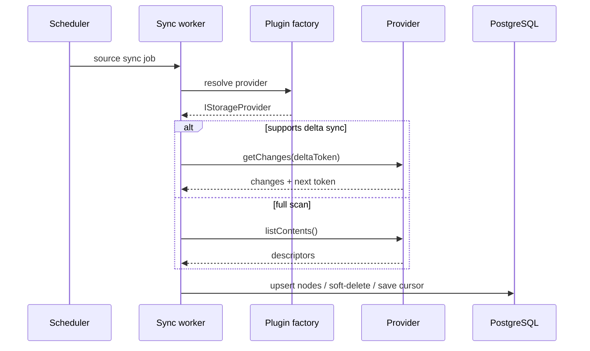

# VFS Architecture

## Components

PostgreSQL is the source of truth for the virtual tree. `virtual_nodes` stores logical hierarchy and provider coordinates; storage plugins perform physical I/O. HTTP handlers only validate requests and enqueue work. Workers perform hydration, synchronization, sharing, and lifecycle operations.

## Plugin boundary

Core code depends only on `IStorageProvider`. `StoragePluginFactory` resolves `provider_type` to an adapter. Adding SFTP, SMB/NFS, Google Drive, or SharePoint requires an adapter and registration, not changes to worker logic.

## Share workflow

## Synchronization workflow

## API contract

`POST /api/v1/sources` validates a source and mapped virtual folder, persists it, and returns `202 Accepted` with a synchronization job ID.

`POST /api/v1/nodes/:id/share` validates recipient and expiration, creates a pending share request, and returns `202 Accepted` with a job ID. The worker hydrates the cache, hashes a random token, and sends the email.

`GET /api/v1/shares/download/:token` must hash the presented token, compare it in constant time, enforce expiration/status/download limits, update access counters, and stream from cache or the provider. The scaffold intentionally returns `501` until a production repository and authorization layer are wired.

## Operational requirements

Use a durable queue such as BullMQ backed by Redis. Add retries with exponential backoff and a dead-letter queue. Encrypt provider configuration or store only a secret-manager reference. Add audit logs, metrics for hydration/sync latency, structured job logs, and alerting for repeated provider failures. Eviction must be policy-driven using `last_accessed_at`, tier, size, and retention rules.
